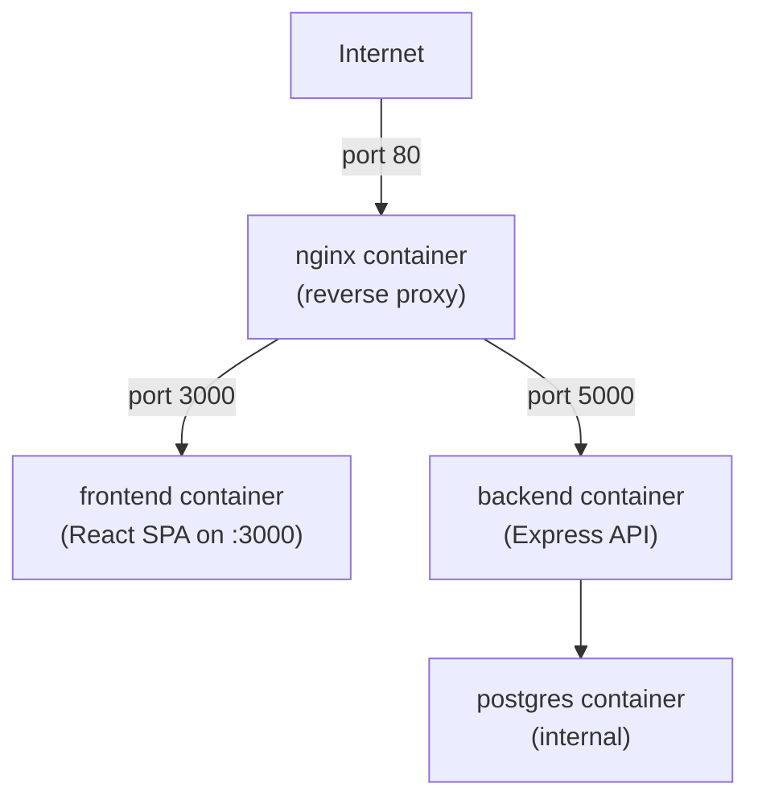

# CI/CD Pipeline Summary

## ✅ Complete! Here's What You Have

### Production Files Ready to Deploy

```
Your GitHub Repository
├── docker-compose.yml              ← Orchestration (4 services)
├── .env.example                    ← Environment template
├── .gitignore                      ← Excludes secrets & build artifacts
├── SETUP_CHECKLIST.md             ← Quick setup reference
├── DEPLOYMENT.md                  ← Detailed deployment guide
├── .github/
│   └── workflows/
│       └── deploy.yml             ← GitHub Actions auto-deploy (3 images)
├── backend/
│   └── Dockerfile                 ← Node.js multi-stage
├── frontend/
│   └── Dockerfile                 ← React SPA server (serve package)
├── nginx/
│   ├── Dockerfile                 ← Lightweight nginx reverse proxy
│   └── nginx.conf                 ← Routes traffic to backend & frontend
```

---

## 📋 Architecture (Separate Services)



**Why separate nginx?**
- ✅ Clean separation of concerns
- ✅ nginx can be scaled/updated independently
- ✅ Better for production patterns
- ✅ Can use existing nginx infrastructure if needed
- ✅ Works well with your existing setup on OCI

---

## 🚀 Pipeline Flow

```
git push main
    ↓
GitHub Actions (ubuntu-latest runner)
    ├─ Build & push backend:latest to OCIR
    ├─ Build & push frontend:latest to OCIR
    └─ Build & push nginx:latest to OCIR
    ↓
    SSH into OCI VM
    └─ docker compose pull
    └─ docker compose up -d
    ↓
Your app live at: http://your-vm-public-ip
```

**Services:**
1. `postgres` — Database (internal only)
2. `backend` — Express API (internal, port 5000)
3. `frontend` — React SPA server (internal, port 3000)
4. `nginx` — Reverse proxy (public, port 80)

---

## 📋 Next Steps to Run the Pipeline

### Step 1️⃣ Get OCI Auth Token
```bash
# OCI Console → My Profile → Auth Tokens → Generate Token
# Save: OCIR_TOKEN (copy & paste into GitHub Secret)
```

### Step 2️⃣ Add 8 GitHub Secrets
```
OCIR_REGISTRY        = bom.ocir.io
OCIR_USERNAME        = your-namespace/your@email.com
OCIR_TOKEN           = <your-auth-token>
OCIR_REPO            = your-namespace/crudapp
OCI_HOST             = your-vm-public-ip
OCI_USER             = ubuntu
OCI_SSH_PRIVATE_KEY  = <contents of ~/.ssh/id_rsa>
DB_PASSWORD          = <strong-password>
```

### Step 3️⃣ Set Up OCI VM (one-time)
```bash
sudo apt update && sudo apt install -y docker.io docker-compose-plugin
sudo usermod -aG docker ubuntu
mkdir -p /home/ubuntu/crudapp
# Create .env file in that directory with matching values
```

### Step 4️⃣ Open Port 80 in OCI
```
OCI Console → VCN → Security List → Add Ingress Rule (port 80)
```

### Step 5️⃣ Push to Main Branch
```bash
git push origin main
```

**Then:**
- GitHub Actions auto-builds all 3 images
- Images push to OCIR
- VM auto-deploys
- App is live at `http://your-vm-public-ip`

---

## 🔐 Secrets Management

**GitHub Secrets (encrypted, used by Actions):**
- OCIR_REGISTRY, OCIR_USERNAME, OCIR_TOKEN, OCIR_REPO
- OCI_HOST, OCI_USER, OCI_SSH_PRIVATE_KEY
- DB_PASSWORD

**OCI VM .env (local, never pushed to GitHub):**
```
DB_NAME=crudapp
DB_USER=cruduser
DB_PASSWORD=same-value-as-github-secret
OCIR_REGISTRY=bom.ocir.io
OCIR_REPO=your-namespace/crudapp
TAG=latest
```

---

## ✨ What Happens Automatically

Once set up, every `git push main`:

1. ✅ GitHub Actions detects the push
2. ✅ Checks out your code
3. ✅ Builds backend Docker image
4. ✅ Builds frontend Docker image (React + serve)
5. ✅ Builds nginx Docker image (reverse proxy)
6. ✅ Pushes all 3 to OCIR
7. ✅ SSHes into your OCI VM
8. ✅ Pulls latest images
9. ✅ Restarts containers with new code
10. ✅ App is updated and live

**Total time:** ~5-10 minutes from push to live.

---

## 🆘 Troubleshooting Quick Guide

| Problem | Solution |
|---|---|
| GitHub Actions fails | Check secrets, SSH key format |
| Can't SSH to VM | Verify key auth: `ssh ubuntu@ip "docker ps"` |
| App not starting | Check logs: `docker compose logs nginx` |
| Can't reach app | Open port 80 in OCI Security List |
| Image pull fails | Check OCIR credentials on VM |
| Disk full on VM | Run: `docker image prune -af` |

---

## 📚 Documentation Files

You have two guides:

- **`SETUP_CHECKLIST.md`** → Quick reference for setup steps
- **`DEPLOYMENT.md`** → Detailed explanation of everything

---

## 🎉 You're Ready!

Follow the checklist and you'll have:
- ✅ Fully automated CI/CD pipeline
- ✅ 3 Docker images built on every push
- ✅ Auto-deployment to OCI
- ✅ Separate nginx reverse proxy
- ✅ Zero-downtime updates
- ✅ Production-grade infrastructure

Good luck! 🚀
